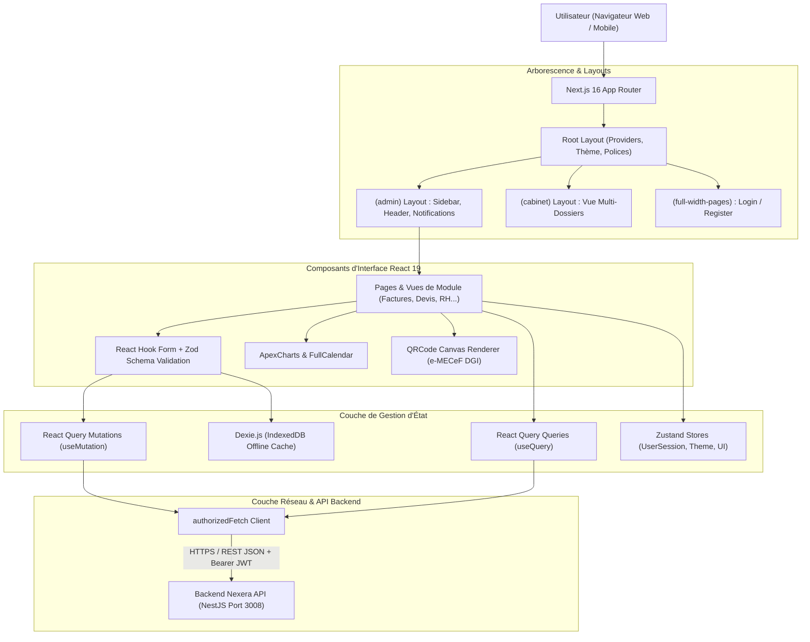

# Architecture Technique — Frontend Nexera ERP

---

## 1. Principes Directeurs & Stack Technologique

Le frontend de **Nexera ERP** est une application web moderne construite sur **Next.js v16** en exploitant l'**App Router**, couplée à **React 19** et **TypeScript 5.9**.

### Les Piliers d'Architecture Frontend :
1. **Séparation Server Components & Client Components** : Exploitation maximale des *React Server Components (RSC)* pour les pages statiques et l'injection de métadonnées SEO, et recours maîtrisé aux *Client Components (`"use client"`)* pour les formulaires interactifs, graphiques et composants dynamiques.
2. **Gestion d'État Découplée à Trois Niveaux** :
   - **Cache Serveur & Requêtes Asynchrones** : Orchestré par **TanStack React Query v5**.
   - **État UI Global** : Géré par des stores légers **Zustand v5** (sidebar, thème, session active).
   - **État de Formulaire** : Géré par **React Hook Form v7** avec validation déclarative **Zod v4**.
3. **Résilience Réseau & Offline-First** : Intégration de **Dexie.js (IndexedDB)** pour la persistance locale des brouillons et la saisie continue en mode déconnecté.
4. **Design System Utilitaire & Performance** : **Tailwind CSS v4** compilé nativement pour un bundle CSS minimal et un support sans faille du mode sombre.

---

## 2. Diagramme de Flux de Données Frontend



---

## 3. Découpage Server Components vs Client Components

Pour optimiser les performances de rendu et la taille du bundle JavaScript expédié au navigateur :

- **Server Components (par défaut)** :
  - Layouts structurels (`layout.tsx`) et pages racines servant d'enveloppes.
  - Déclaration des métadonnées statiques (balises `<title>`, `<meta name="description">`).
  - Composants purement présentatifs sans état interactif.
- **Client Components (`"use client"`)** :
  - Tous les formulaires réactifs utilisant `useForm` ou `useState` (ex. `InvoiceForm.tsx`, `NormalizeInvoiceModal.tsx`).
  - Les composants exploitant les hooks du navigateur (`useEffect`, `useMediaQuery`, `navigator.clipboard`).
  - Les bibliothèques tierces nécessitant l'accès au DOM (`qrcode`, `apexcharts`, `swiper`, `flatpickr`).

---

## 4. Gestion d'État : React Query + Zustand

### 4.1 Cache de Données Serveur (TanStack React Query v5)
Toutes les requêtes de lecture et de modification de données backend passent par React Query :
```typescript
// Exemple de requête paginée de factures avec cache
export function useInvoices(filters: InvoiceFilters) {
  return useQuery({
    queryKey: ['invoices', filters],
    queryFn: () => invoicesApi.getInvoices(filters),
    staleTime: 1000 * 60 * 2, // Les données restent fraîches 2 minutes
  });
}

// Exemple de mutation avec invalidation de cache ciblée
export function useNormalizeInvoice() {
  const queryClient = useQueryClient();
  return useMutation({
    mutationFn: (payload: { invoiceId: string; aibType?: MecefAibType }) =>
      invoicesApi.normalizeInvoice(payload.invoiceId, { aibType: payload.aibType }),
    onSuccess: (updatedInvoice) => {
      // Invalidation immédiate pour rafraîchir la liste et la fiche détail
      queryClient.invalidateQueries({ queryKey: ['invoices'] });
      queryClient.setQueryData(['invoice', updatedInvoice.id], updatedInvoice);
    },
  });
}
```

### 4.2 État Global d'Interface (Zustand v5)
Zustand est utilisé exclusivement pour les états purement frontends ne nécessitant pas de synchronisation serveur continue :
- État du menu latéral (Sidebar pliée/dépliée).
- Thème d'affichage actif (Mode clair / Mode sombre / Système).
- Contexte de session et workspace actif pour les experts-comptables.

---

## 5. Client HTTP Centralisé : `authorizedFetch`

Toutes les requêtes sortantes vers l'API backend sont encapsulées dans la fonction utilitaire `authorizedFetch` (`src/core/api/authorizedFetch.ts`) :

1. **Injection Automatique des Headers** :
   - Insertion du jeton `Authorization: Bearer <token>` récupéré du stockage sécurisé.
   - Insertion de `X-Tenant-Id` si un contexte d'organisation particulier est forcé.
2. **Interception des Erreurs 401 & Silent Refresh** :
   - Si le backend renvoie `HTTP 401 Unauthorized`, `authorizedFetch` suspend temporairement la requête, sollicite `/api/auth/refresh` avec le refresh token stocké, met à jour le token d'accès et rejoue automatiquement la requête initiale de manière totalement transparente pour l'utilisateur.
3. **Formatage Unifié des Erreurs** :
   - Désérialisation des messages d'erreur renvoyés par la `ValidationPipe` NestJS et transformation en exceptions typées exploitables directement par les formulaires.
