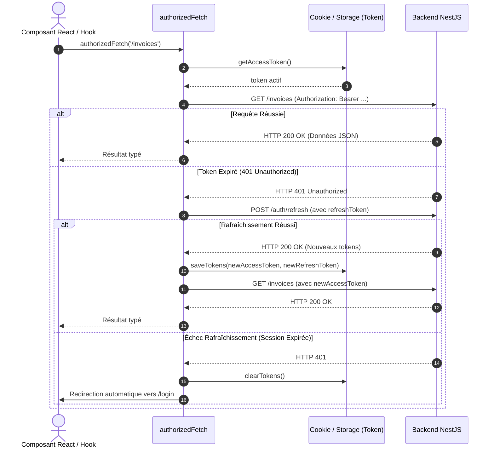

# Intégration & Consommation d'API — Frontend Nexera ERP

---

## 1. Organisation Modulaire des Services API

Le frontend structure ses appels réseau au sein de services dédiés par domaine fonctionnel, logés dans `src/modules/[module]/services/` :

```
front-endV1/src/modules/
├── auth/services/authApi.service.ts          # Authentification, sessions, profil
├── catalogue/services/catalogueApi.service.ts # Articles, catégories, tarifs
├── clients/services/clientsApi.service.ts    # Tiers, contacts, encours
├── devis/services/quotationsApi.service.ts   # Devis, envoi email, conversion
├── commandes/services/ordersApi.service.ts   # Commandes, bons de livraison
├── factures/services/invoicesApi.service.ts  # Factures, certification e-MECeF, PDF
├── encaissements/services/paymentsApi.service.ts # Paiements, imputations, reçus
├── rh/services/rhApi.service.ts              # Salariés, contrats, calcul paie
├── notes-frais/services/notesFraisApi.service.ts # Dépenses, justificatifs, avances
├── fiscalite/services/fiscaliteApi.service.ts # Déclarations TVA, AIB, export FEC
└── parametres/services/settingsApi.service.ts # Entreprise, taxes, devises, e-MECeF
```

---

## 2. Exemple Concret : Service de Facturation & e-MECeF

Extrait du fichier [invoicesApi.service.ts](file:///c:/Sikirou/eskay/FEMAX/Nexera/front-endV1/src/modules/factures/services/invoicesApi.service.ts) illustrant l'intégration des endpoints de normalisation fiscale :

```typescript
export const invoicesApi = {
  getInvoices: (filters?: InvoiceFilters) =>
    authorizedFetch<PaginatedInvoicesResponse>('/invoices', { query: filters }),

  getInvoice: (id: string) =>
    authorizedFetch<InvoiceDetail>(`/invoices/${id}`),

  createInvoice: (payload: CreateInvoicePayload) =>
    authorizedFetch<InvoiceDetail>('/invoices', {
      method: 'POST',
      body: payload,
    }),

  issueInvoice: (id: string) =>
    authorizedFetch<InvoiceDetail>(`/invoices/${id}/issue`, {
      method: 'POST',
    }),

  // Normalisation fiscale auprès de la DGI Bénin
  normalizeInvoice: (id: string, payload?: { aibType?: MecefAibType }) =>
    authorizedFetch<InvoiceDetail>(`/invoices/${id}/normalize`, {
      method: 'POST',
      body: payload,
    }),

  // Paramétrage e-MECeF de l'entreprise
  getMecefConfig: () =>
    authorizedFetch<MecefConfig>('/invoices/mecef/config'),

  updateMecefConfig: (payload: UpdateMecefConfigPayload) =>
    authorizedFetch<MecefConfig>('/invoices/mecef/config', {
      method: 'PATCH',
      body: payload,
    }),
};
```

---

## 3. Client HTTP `authorizedFetch` & Gestion du Cycle de Vie des Jetons

La fonction `authorizedFetch` centralise la gestion de la sécurité et des erreurs réseau :



---

## 4. Retours Visuels & Gestion des États de Chargement

Pour garantir une expérience utilisateur fluide et éviter les erreurs de double soumission :
- **Désactivation Automatique des Boutons** : Tout bouton de soumission de formulaire (`Button type="submit"`) est automatiquement désactivé avec état `loading` (spinner) dès que `isSubmitting` ou `isPending` passe à `true`.
- **Notifications Toasts Découplées** : Les succès d'action (ex. *« Facture émise avec succès »*, *« Certification e-MECeF validée »*) affichent une notification discrète en haut à droite avec disparition automatique après 3 secondes.
