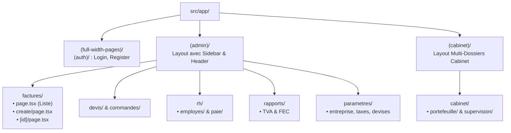

# Architecture d'Interface Approfondie — Frontend Nexera ERP

---

## 1. Arborescence du Routing Next.js 16 (App Router)

L'application exploite les groupes de routes (*Route Groups*) pour isoler les contextes d'affichage sans impacter les URLs publiques :

---

## 2. Cycle de Rendu des Composants (Server vs Client)

1. **Première Requête (SSR)** : Next.js génère le squelette HTML côté serveur en exécutant les composants parents statiques.
2. **Hydratation Sélective** : Le navigateur reçoit le HTML pré-rendu et télécharge uniquement les bundles JavaScript nécessaires aux composants interactifs (`"use client"`).
3. **Navigation Côté Client (SPA)** : Les changements de page via `<Link>` ou `router.push()` sont instantanés, ne téléchargeant que les fragments JSON de la nouvelle route sans recharger la page entière.

---

## 3. Gestion des Erreurs Granulaire par Route

Chaque segment de route dispose de ses propres gestionnaires d'état de transition :
- `loading.tsx` : Affiche instantanément un composant skeleton adapté pendant la récupération asynchrone des données.
- `error.tsx` : Intercepte les exceptions imprévues au sein de la page et propose un bouton de réinitialisation sans crasher l'ensemble du layout applicatif.
- `global-error.tsx` : Filet de sécurité ultime au niveau racine du document HTML.
